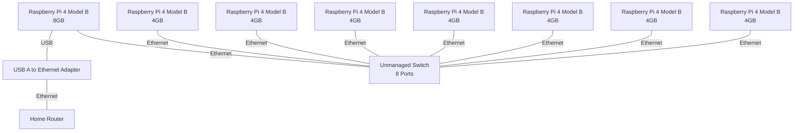

# raspberrypi-k3s

## 概要
Raspberry Piを使用してK3sクラスタを構築するためのスクリプトを提供します。このドキュメントでは、必要なハードウェアの構成から、設定ファイルの準備、cloud-initファイルとシェルスクリプトの生成、各ノードの起動、そしてK3sのセットアップまでの具体的な手順を説明しています。また、マスターノードおよびワーカーノードの動作確認方法についても記載しています。
## 主に必要なハードウェア
- Raspberry Pi 4 Model B (8GB) × 1
- Raspberry Pi 4 Model B (4GB) × 7
- USB A to Ethernet Adapter × 1 ([バッファロー 有線LANアダプター Giga Type-A USB3.2(Gen1)対応 日本メーカー 【 macOS/Nintendo Switch 動作確認済み 】 ブラック LUA5-U3-AGTE-NBK](https://amzn.asia/d/bGedPpg))
- Unmanaged Switch (8 Ports) × 1 ([バッファロー 8ポート スイッチングハブ Giga 金属筐体 簡易パッケージ 壁掛け設置対応 LSW6-GT-8ESL/NBK](https://amzn.asia/d/hty88OI))

## 構成図



## k3s構築スクリプトの利用方法
### 前提条件
- Raspberry Pi Imagerを使用し、全てのSDカードにUbuntu Server 24.04.1 LTS (64bit) 以上が書き込まれていること。

### 手順
1. リポジトリのクローン
    ```sh
    git clone https://github.com/penguinspizza/raspberrypi-k3s.git
    cd raspberrypi-k3s
    ```

1. 設定ファイルの準備
    - `config.yaml` に必要な情報を正確に入力してください。コメントを参考にして、各ノードに必要な設定を記述してください。

1. cloud-initファイルとシェルスクリプトの生成
    ```sh
    docker build -t k3s-config-generator . && docker run --rm -v $(pwd)/output:/app/output k3s-config-generator --manual-link-up
    ```
    - `./output/<uuid>/<各ホスト名>`配下に、各ノードで必要なcloud-initファイルが生成されます。`<uuid>`は生成ごとに異なる値が割り当てられます。
    - マスターノードには追加でシェルスクリプトも生成されます。
    - `--manual-link-up`オプションは、Ubuntu Server 24.04.1 LTS (64bit) で再起動後にUSB A to Ethernetアダプタがリンクアップしない不具合に対処するために使用します。このオプションを指定することで、手動でアダプタを抜き差ししてリンクアップさせ、その後にk3sの構築を行うことが可能になります。

1. 設定ファイルの配置
    1. 各ノードのSDカードをPCで開き、bootパーティションの`network-config`と`user-data`の内容を各ノード用に生成されたものに書き換えます。
    1. `--manual-link-up`オプションを指定した場合は、マスターノードの`config.txt`の最下行に`enable_uart=1` を追加します。
1. 起動
    1. マスターノードを起動します。
       - `--manual-link-up`オプションを指定した場合は、USB A to Ethernetアダプタを接続せずに起動してください。
       - また、シリアルコンソールで接続できるように準備しておいてください。
    1. USB Ethernetアダプタを接続します。
       - シリアルコンソールで `ip link show` などのコマンドを使用して、ネットワークインターフェースが正しく認識されているか確認することをお勧めします。
    1. 以下のコマンドを実行して必要なパッケージをインストールします。
       ```sh
       sudo apt update && sudo apt install -y avahi-daemon isc-dhcp-server
       ```
       インストール中に、以下のような設定ファイルの選択を求められた場合は、`N`を選択して現在の設定を保持してください。
       ```
       Configuration file '/etc/dhcp/dhcpd.conf'
        ==> File on system created by you or by a script.
        ==> File also in package provided by package maintainer.
          What would you like to do about it? Your options are:
           Y or I  : install the package maintainer's version
           N or O  : keep your currently-installed version
             D     : show the differences between the versions
             Z     : start a shell to examine the situation
        The default action is to keep your current version.
       *** dhcpd.conf (Y/I/N/O/D/Z) [default=N] ? N
       ```
    1. 設定完了後、マスターノードを再起動します。
       ```sh
       sudo reboot
       ```
    1. 再起動後、リンクアップさせるためにUSB Ethernetアダプタを再度抜き差ししてください。
       - シリアルコンソールでリンクアップを確認することをお勧めします。
1. SSHでのアクセスに切り替え
    1. SSHを使用してマスターノードに接続します。
    1. `scp`コマンドなどを使用して、`k3s_setup.sh` をマスターノードにアップロードします。
    1. アップロードしたスクリプトに実行権限を付与します。
       ```sh
       sudo chmod +x k3s_setup.sh
       ```
1. k3sセットアップスクリプトの実行
    1. `k3s_setup.sh`を実行して、マスターノードのK3sセットアップを行います。

1. 残りのノードの起動
    1. 残りのノードをすべて起動します。

## 動作確認方法
- マスターノードにSSHで接続し、`kubectl get nodes` コマンドを実行して全てのノードが正しく登録されていることを確認してください。
